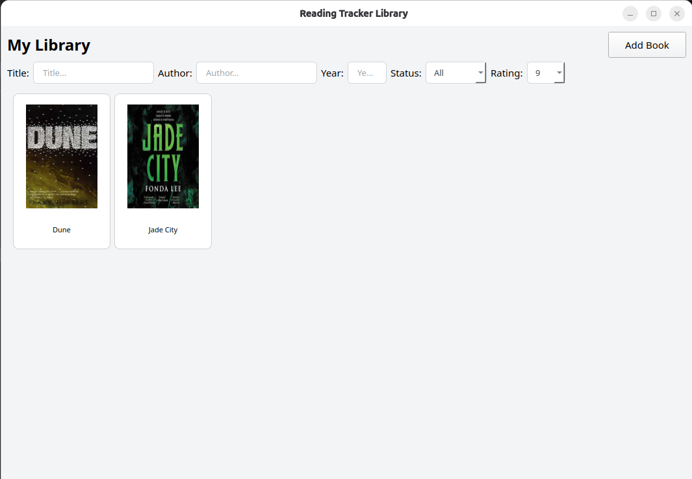
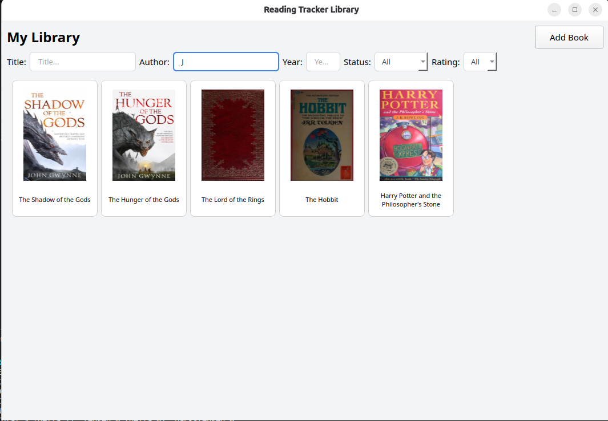
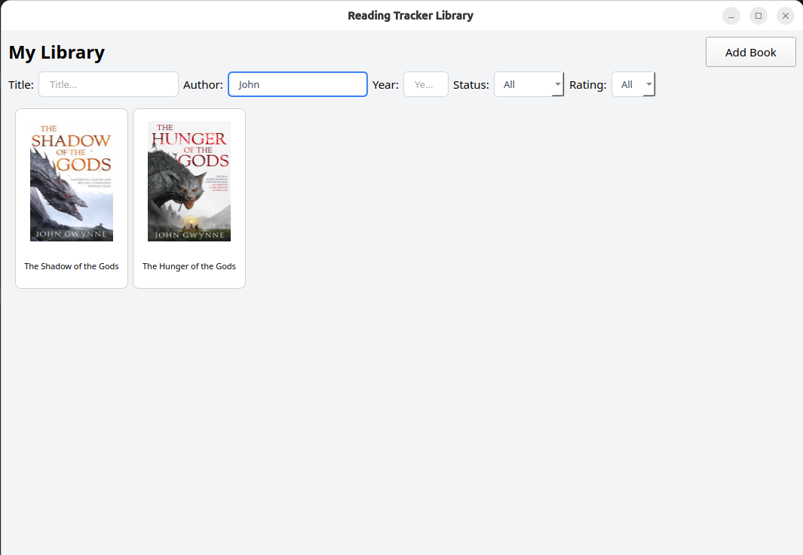
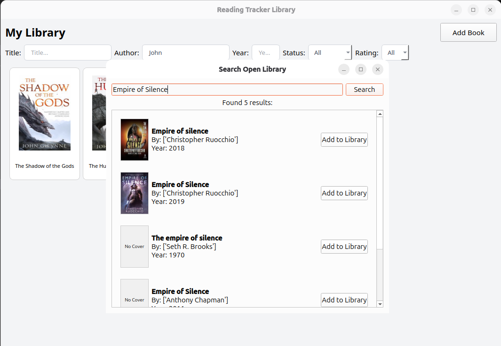

# Reading Tracker

A lightweight, responsive desktop application built with Python and PyQt6 for managing a personal library. It integrates with the Open Library API to automatically fetch book metadata and covers, storing them in a local relational SQLite database.

## Technical Highlights

* **Asynchronous Networking:** Uses `QThread` to handle API calls and image downloading in the background, ensuring the GUI never freezes.
* **Responsive Grid UI:** Features a custom masonry-style layout engine that recalculates coordinates on window resize without destroying and re-rendering widgets, heavily optimizing memory usage.
* **Relational Data Integrity:** Enforces `ON DELETE CASCADE` and foreign key pragmas to maintain strict mapping between books and authors.

### Real-Time SQL Filtering
Implements dynamic query building to filter the SQLite database by Title, Author, Year, Status, and Rating simultaneously on keystroke.

*Filtering by Rating:*

*Filtering dynamically by Author:*

### Open Library API Integration
Search and add books directly from the Open Library database with asynchronous cover art fetching.

## Tech Stack
* **Language:** Python 3
* **GUI Framework:** PyQt6
* **Database:** SQLite3
* **External APIs:** Open Library API

## How to Run
1. Clone the repository.
2. Install dependencies: `pip install -r requirements.txt`
3. Run the application: `python main.py`